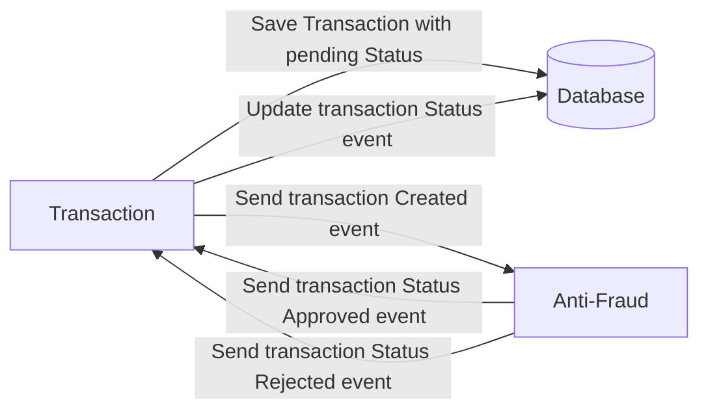
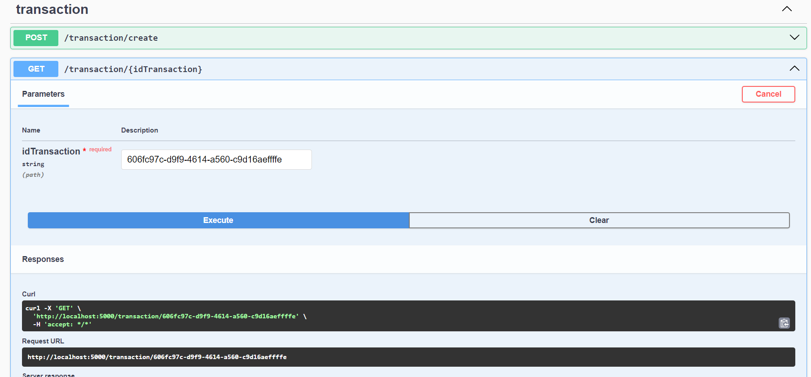
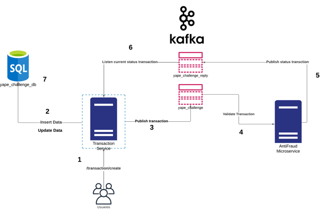
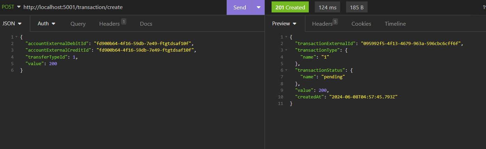
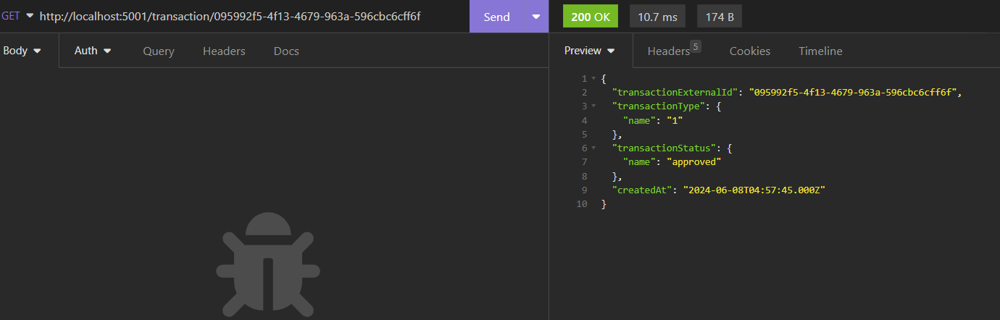

# Yape Code Challenge :rocket:

Our code challenge will let you marvel us with your Jedi coding skills :smile:. 

Don't forget that the proper way to submit your work is to fork the repo and create a PR :wink: ... have fun !!

- [Problem](#problem)
- [Tech Stack](#tech_stack)
- [Send us your challenge](#send_us_your_challenge)

# Problem

Every time a financial transaction is created it must be validated by our anti-fraud microservice and then the same service sends a message back to update the transaction status.
For now, we have only three transaction statuses:

<ol>
  <li>pending</li>
  <li>approved</li>
  <li>rejected</li>  
</ol>

Every transaction with a value greater than 1000 should be rejected.



# Tech Stack

<ol>
  <li>Node. You can use any framework you want (i.e. Nestjs with an ORM like TypeOrm or Prisma) </li>
  <li>Any database</li>
  <li>Kafka</li>    
</ol>

We do provide a `Dockerfile` to help you get started with a dev environment.

You must have two resources:

1. Resource to create a transaction that must containt:

```json
{
  "accountExternalIdDebit": "Guid",
  "accountExternalIdCredit": "Guid",
  "tranferTypeId": 1,
  "value": 120
}
```

2. Resource to retrieve a transaction

```json
{
  "transactionExternalId": "Guid",
  "transactionType": {
    "name": ""
  },
  "transactionStatus": {
    "name": ""
  },
  "value": 120,
  "createdAt": "Date"
}
```

## Optional

You can use any approach to store transaction data but you should consider that we may deal with high volume scenarios where we have a huge amount of writes and reads for the same data at the same time. How would you tackle this requirement?

You can use Graphql;

# How to resolve the problem

To solve the problem, consider the following technological stack:
  - Database: MySql
  - Nodejs Framework: Nestjs
  -ORM: No
  -Kafka

2 endpoints were defined, which will be responsible for starting the transaction validation process as well as another endpoint that allows knowing the current status of the transaction, as shown below:



The process that was followed was the following:

- Validation process
  The validation process follows the following flow:

  

  1. The transaction validation process begins with the query to the endpoint **/transaction/create**, which returns a unique identifier (uuid) as shown below:

  

  2. At that time the record will be created in the transaction database.

  3. It is publish to the topic **yape_challenge**

  4. El microservicio Antifraud está activamente escuchando en es tópico, por lo que valida la transacción.

  5. The validation result is published in the topic **yape_challenge_reply**.

  6. Such a topic is continually heard by the transaction service.

  7. Finally the status of the transaction is updated.

- Get transaction status 

  Once the process is completed, the endpoint **/transaction/:idProcess** is consulted with the identifier obtained in the first step to know the status of the transaction, obtaining the following response:

  

In order to test the services, the Insomnia collection is attached, called **InsomniaCollection** in the **source** folder.

# Demo
The demo video in the following path **source/AppDemo.mp4**

<video width="1920" height="1080" controls>
  <source src="source/AppDemo.mp4" type="video/mp4">
  Tu navegador no soporta la etiqueta de video.
</video>

